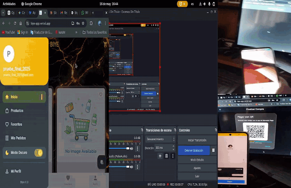
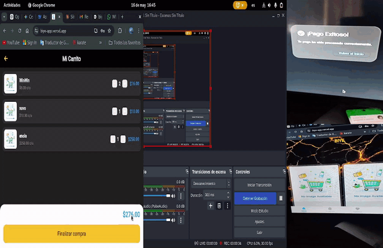

<div align="center">
  
# 🛒 **BIYE** <sub><sub>v1.0</sub></sub>

### *Plataforma de E-commerce Fullstack* ⚡

[](https://flutter.dev)
[](https://nodejs.org)
[](https://mongodb.com)
[](https://mercadopago.com)

</div>

---

Biye es una plataforma de e-commerce fullstack moderna y flexible, pensada para adaptarse fácilmente a distintos tipos de negocio. 

Cuenta con un sistema de pagos robusto integrado con Mercado Pago (tanto QR presencial como tarjetas online), incluyendo confirmación en tiempo real mediante webhooks y polling, y está construida sobre una arquitectura limpia y escalable.

---
## ✨ Demo en Vivo
- **Frontend (Web)**: [Ver Demo](https://biye-app-final.vercel.app)
- **Backend API**: [https://biye-ecommerce-production.up.railway.app](https://biye-ecommerce-production.up.railway.app)
> Proyecto desarrollado con enfoque en robustez de pagos y escalabilidad.

---

## 📸 Capturas de Pantalla

<div align="center">
  
| Pantalla de Inicio | Sección / Favoritos |
|:------------------:|:-------------------:|
|  |  |

</div>

> ⚡ Aplicación en funcionamiento - Vista de productos y navegación.
---

## 🚀 Características Principales

- ✅ **Sistema de pagos completo con Mercado Pago**
  - QR para pago presencial
  - Checkout Pro con tarjeta (online)
  - Webhook + Polling inteligente + Fallback automático
  - Idempotencia en pagos
- ✅ Gestión completa de órdenes, direcciones y métodos de pago
- ✅ Autenticación JWT segura
- ✅ Arquitectura limpia (BLoC + Clean Architecture en frontend)
- ✅ Rate limiting y manejo robusto de errores
- ✅ Fácilmente adaptable a diferentes negocios
- ✅ Soporte para modo Sandbox y Producción

---

## 🛠️ Stack Tecnológico 

### Frontend
- **Flutter & Dart**

### Backend
- **Node.js, Express, MongoDB & Redis**

### DevOps & Deploy
- **Docker, Railway & Vercel**

---

## 🧪 Tests

[](https://github.com/MartinBernardoBonilla/biye-ecommerce/tree/main/frontend/test)

El proyecto incluye **19 tests automatizados** que garantizan la estabilidad del sistema:

| Tipo         | Cantidad | Cobertura                                                             |
|--------------|----------|----------------------------------------------------------------------|
| Unit tests   | 17       | Lógica de negocio: carrito, validaciones (email/teléfono), descuentos |
| Widget tests | 2        | Renderizado y comportamiento básico de componentes en Flutter        |

### ▶️ Ejecutar tests

```bash
cd frontend
flutter test
```

---

## 🎥 Demo

### 🎬 Video completo del flujo de compra

<video src="https://github.com/MartinBernardoBonilla/biye-ecommerce/raw/main/assets/output_final.mp4" 
       width="100%" 
       style="max-width: 900px; border-radius: 12px;" 
       controls 
       autoplay 
       loop 
       muted></video>

### 📱 Flujos detallados

**1. Agregar productos al carrito**  


**2. Checkout y resumen de compra**  


## 🚀 Cómo Instalar y Ejecutar

```bash
git clone https://github.com/MartinBernardoBonilla/biye-ecommerce.git
cd biye-ecommerce
```

---

### 2. Configuración del Backend

```bash
cd backend
npm install
cp .env.example .env
```

Editar el archivo `.env`:

```env
PORT=5000
MONGODB_URI=tu_url_de_mongodb
MERCADOPAGO_ACCESS_TOKEN=APP_USR-tu_token
NGROK_BASE_URL=https://tu-ngrok.ngrok-free.dev
JWT_SECRET=tu_clave_secreta
```

Iniciar servidor:

```bash
npm run dev
```

---

### 3. Configuración del Frontend

```bash
cd frontend
flutter pub get
flutter run
```

---

## 🏗️ Arquitectura

```text
Flutter App (Frontend)
        │
        ▼
Node.js Backend (API REST)
        │
        ├── MongoDB (Órdenes / Usuarios / Pagos)
        │
        ├── MercadoPago API
        │       │
        │       └── Webhooks (notificación de pagos)
        │
        └── Polling Service (reconciliación de estados)
```

---

## 🧠 Decisiones Técnicas Clave

### 💳 Manejo de pagos (problema real)

El sistema está diseñado para manejar **inconsistencias entre estados de pago** (`pending`, `paid`, `failed`) debido a la naturaleza distribuida de MercadoPago.

---

### ⚙️ Estrategia implementada

#### 1. Webhooks (fuente principal)
- MercadoPago notifica eventos de pago
- Backend actualiza el estado de la orden

#### 2. Polling (fallback)
- El frontend consulta el estado periódicamente
- Si el estado permanece en `pending`, el backend consulta a MercadoPago
- Se corrigen inconsistencias automáticamente

#### 3. Idempotencia
- Se evita duplicación de eventos usando `payment_id` como clave única
- Webhooks duplicados no afectan el estado

#### 4. Consistencia eventual
- La base de datos refleja el estado final con retraso controlado
- La **fuente de verdad es MercadoPago**, no la DB

---

### 🧩 Resolución de conflictos

Se define una jerarquía de estados:

```
pending < processing < paid < failed
```

Siempre prevalece el estado más avanzado reportado por el proveedor de pagos.

---

### 🚨 Problemas reales que resuelve

- Webhooks que fallan o llegan tarde  
- Pagos confirmados pero no reflejados en la app  
- Duplicación de eventos  
- Usuarios que cierran la app antes de confirmación  

---

## 🗺️ Roadmap

- ✅ Sistema de pagos (QR + Tarjeta)
- ✅ Webhook + Polling + Idempotencia
- 🔜 Dashboard administrativo
- 🔜 Notificaciones por email
- 🔜 Sistema de cupones y descuentos
- 🔜 Soporte multi-negocio (multi-tenant)

---

## 📫 Contacto

- 💼 LinkedIn: https://www.linkedin.com/in/martinbernardobonilla/
- 💻 GitHub: https://github.com/MartinBernardoBonilla
- 📧 Email: martinbernardobonilla@gmail.com
- 🌐 Portfolio-WoodStack: https://woodstack-portfolio.vercel.app

---

## 📌 Disponibilidad

🟢 100% remoto  
🟢 Primera experiencia laboral o proyectos freelance  

---

## 👤 Autor

**Martín Bernardo Bonilla**  
Fullstack Developer  

---

## 📄 Licencia

MIT © 2026 Martín Bernardo Bonilla
